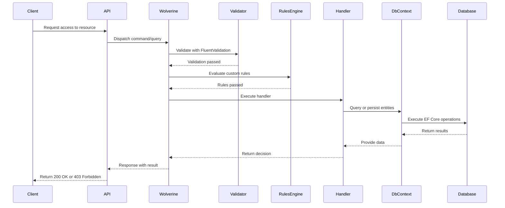

📖 RBAC Library (Clean Architecture)
🚀 Overview
This library provides a Role-Based Access Control (RBAC) implementation built with Clean Architecture principles.
It is designed for enterprise-grade applications where maintainability, scalability, and developer ergonomics are critical.
Key features:
- Clean separation of Domain, Application, Infrastructure, and API layers.
- Support for Users, Roles, Permissions, Organizations, Departments, PII fields, Masking rules.
- Soft delete and audit logging via EF Core interceptors.
- Wolverine command/query bus for CQRS and event-driven workflows.
- FluentValidation for request validation.
- Rules Engine for configurable, custom business rules.

🏗 Architecture
This library follows Clean Architecture:
- Domain: Entities, value objects, exceptions, interfaces.
- Application: Commands, queries, handlers, pipeline behaviors, validators, rules.
- Infrastructure: EF Core DbContext, repositories, Unit of Work, interceptors.
- API: Controllers or endpoints consuming Application layer.

- 📂 Project Structure

src/
 ├── RbacService.Domain/
 │    ├── Entities/
 │    ├── Exceptions/
 │    └── Interfaces/
 ├── RbacService.Application/
 │    ├── Commands/
 │    ├── Queries/
 │    ├── Handlers/
 │    ├── Interfaces/
 │    ├── Pipeline/
 │    ├── Validators/        
 │    └── Rules/             
 ├── RbacService.Infrastructure/
 │    ├── Data/
 │    ├── Repositories/
 │    ├── Interceptors/
 │    └── DependencyInjection/
 └── RbacService.Api/
      └── Controllers/

🔄 Sequence Diagram (Authorization Flow)

🧩 C4 Component Diagram

C4Component
    title RBAC Library - Component Diagram

    Container_Boundary(api, "API Layer") {
        Component(controller, "Controllers", "ASP.NET Core", "Expose endpoints for RBAC operations")
    }

    Container_Boundary(app, "Application Layer") {
        Component(commands, "Commands/Queries", "Wolverine", "Encapsulate use cases")
        Component(handlers, "Handlers", "Wolverine", "Execute business logic")
        Component(validators, "Validators", "FluentValidation", "Validate incoming requests")
        Component(rules, "Rules Engine", "RulesEngine", "Evaluate custom business rules")
        Component(pipeline, "Pipeline Behaviors", "Wolverine", "Inject user context, auditing")
    }

    Container_Boundary(domain, "Domain Layer") {
        Component(entities, "Entities", "C#", "User, Role, Permission, Organization, Department, PiiField, MaskingRule")
        Component(services, "Domain Services", "C#", "AccessEvaluator, MaskingService")
        Component(exceptions, "Exceptions", "C#", "AccessDeniedException, PiiAccessViolationException")
    }

    Container_Boundary(infra, "Infrastructure Layer") {
        Component(dbcontext, "RbacDbContext", "EF Core", "Database context with relationships")
        Component(repos, "Repositories", "EF Core", "Concrete implementations of repository interfaces")
        Component(uow, "UnitOfWork", "EF Core", "Transaction boundary and repository aggregator")
        Component(interceptors, "Interceptors", "EF Core", "Audit & soft delete logic")
    }

    Rel(controller, commands, "Dispatches via Wolverine")
    Rel(commands, handlers, "Handled by")
    Rel(handlers, validators, "Validated by")
    Rel(handlers, rules, "Rules evaluated by")
    Rel(handlers, entities, "Uses")
    Rel(handlers, services, "Uses")
    Rel(handlers, repos, "Accesses via UnitOfWork")
    Rel(repos, dbcontext, "Uses")
    Rel(dbcontext, Database, "Persists entities")

⚙️ Getting Started

- Install dependencies:
dotnet add package Wolverine
dotnet add package FluentValidation
dotnet add package RulesEngine
dotnet add package Microsoft.EntityFrameworkCore
dotnet add package Microsoft.EntityFrameworkCore.SqlServer

- Register services in Program.cs:
builder.Services.AddDbContext(connectionString);
builder.Services.AddWolverine();
builder.Services.AddValidatorsFromAssemblyContaining<UserCreatedCommandValidator>();
builder.Services.AddRulesEngine();

- Run migrations:
dotnet ef migrations add InitialCreate -p RbacService.Infrastructure -s RbacService.Api
dotnet ef database update -p RbacService.Infrastructure -s RbacService.Api



🔄 Example Flow: UserCreatedCommand

Command
public record UserCreatedCommand(string Email, string FirstName, string LastName) : ICommand<User>;



Validator (FluentValidation)
public class UserCreatedCommandValidator : AbstractValidator<UserCreatedCommand>
{
    public UserCreatedCommandValidator()
    {
        RuleFor(x => x.Email).NotEmpty().EmailAddress();
        RuleFor(x => x.FirstName).NotEmpty().MaximumLength(50);
        RuleFor(x => x.LastName).NotEmpty().MaximumLength(50);
    }
}



Rules Engine
Example JSON rule:
[
  {
    "WorkflowName": "UserCreation",
    "Rules": [
      {
        "RuleName": "BlockCertainDomains",
        "SuccessEvent": "ValidDomain",
        "ErrorMessage": "Email domain not allowed",
        "RuleExpressionType": "LambdaExpression",
        "Expression": "input.Email.EndsWith(\"@blocked.com\") == false"
      }
    ]
  }
]

Evaluator:
public class UserCreationRuleEvaluator
{
    private readonly RulesEngine.RulesEngine _rulesEngine;

    public UserCreationRuleEvaluator(RulesEngine.RulesEngine rulesEngine)
    {
        _rulesEngine = rulesEngine;
    }

    public async Task<bool> ValidateAsync(UserCreatedCommand command)
    {
        var result = await _rulesEngine.ExecuteAllRulesAsync("UserCreation", command);
        return result.All(r => r.IsSuccess);
    }
}



Handler (Wolverine)
public class UserCreatedCommandHandler : ICommandHandler<UserCreatedCommand, User>
{
    private readonly RbacDbContext _dbContext;
    private readonly UserCreationRuleEvaluator _ruleEvaluator;

    public UserCreatedCommandHandler(RbacDbContext dbContext, UserCreationRuleEvaluator ruleEvaluator)
    {
        _dbContext = dbContext;
        _ruleEvaluator = ruleEvaluator;
    }

    public async Task<User> Handle(UserCreatedCommand command, CancellationToken cancellationToken)
    {
        var rulesPassed = await _ruleEvaluator.ValidateAsync(command);
        if (!rulesPassed)
            throw new InvalidOperationException("Business rules failed for user creation.");

        var user = new User
        {
            Email = command.Email,
            FirstName = command.FirstName,
            LastName = command.LastName,
            CreatedAt = DateTime.UtcNow
        };

        _dbContext.Users.Add(user);
        await _dbContext.SaveChangesAsync(cancellationToken);

        return user;
    }
}



Sequence Diagram
sequenceDiagram
    participant Client
    participant API
    participant Wolverine
    participant Validator
    participant RulesEngine
    participant Handler
    participant DbContext
    participant Database

    Client->>API: POST /users
    API->>Wolverine: Dispatch UserCreatedCommand
    Wolverine->>Validator: Validate with FluentValidation
    Validator-->>Wolverine: Validation passed
    Wolverine->>RulesEngine: Evaluate UserCreation rules
    RulesEngine-->>Wolverine: Rules passed
    Wolverine->>Handler: Execute UserCreatedCommandHandler
    Handler->>DbContext: Add new User entity
    DbContext->>Database: SaveChangesAsync()
    Database-->>DbContext: Persisted
    DbContext-->>Handler: User created
    Handler-->>Wolverine: Return User
    Wolverine-->>API: Success response
    API-->>Client: 201 Created + User details
