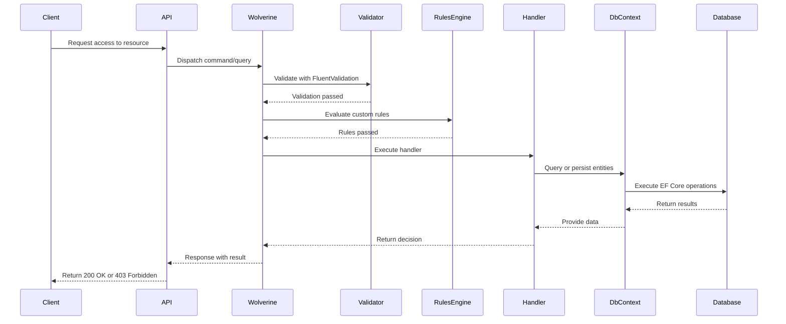
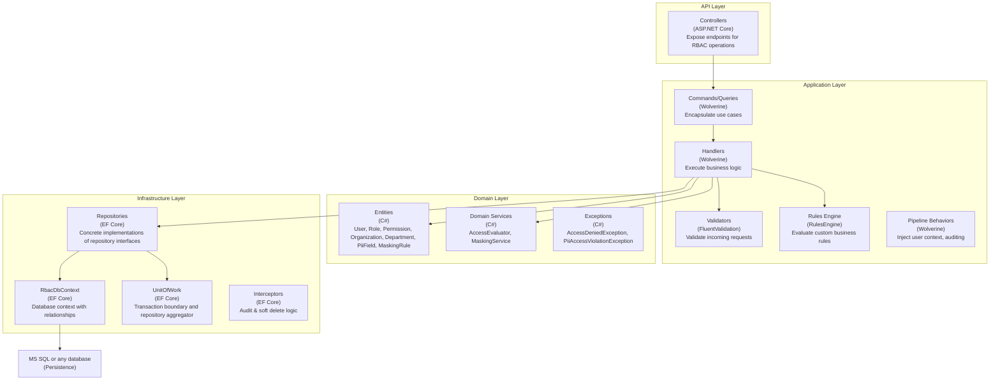
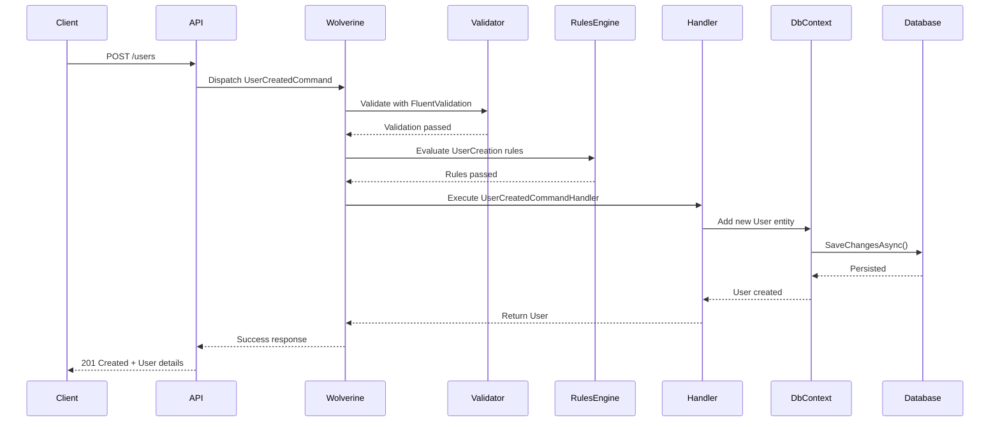

📖 RBAC Library (Clean Architecture)
🚀 Overview
This library provides a Role-Based Access Control (RBAC) implementation built with Clean Architecture principles.
It is designed for enterprise-grade applications where maintainability, scalability, and developer ergonomics are critical.
Key features:
- Clean separation of Domain, Application, Infrastructure, and API layers.
- Support for Users, Roles, Permissions, Organizations, Departments, PII fields, Masking rules.
- Soft delete and audit logging via EF Core interceptors.
- Wolverine command/query bus for CQRS and event-driven workflows.
- FluentValidation for request validation.
- Rules Engine for configurable, custom business rules.

🏗 Architecture
This library follows Clean Architecture:
- Domain: Entities, value objects, exceptions, interfaces.
- Application: Commands, queries, handlers, pipeline behaviors, validators, rules.
- Infrastructure: EF Core DbContext, repositories, Unit of Work, interceptors.
- API: Controllers or endpoints consuming Application layer.

- 📂 Project Structure

```
src/
 ├── RbacService.Domain/
 │    ├── Entities/
 │    ├── Exceptions/
 │    └── Interfaces/
 ├── RbacService.Application/
 │    ├── User/
 |    |    |──Commands/
 |    |    |──CommandHandlers/
 |    |    |──Queries/
 |    |    |──QueryHandlers/
 │    ├── Roles/
 │    ├── DTOs/
 │    ├── Mappings/
 │    ├── Pipeline/
 │    ├── Validators/        
 │    └── Rules/             
 ├── RbacService.Infrastructure/
 │    ├── Data/
 │    ├── Repositories/
 │    ├── Interceptors/
 │    └── UnitOfWork/
 └── RbacService.Api/
      └── Controllers/
```


🔄 Sequence Diagram (Authorization Flow)



🧩 C4 Component Diagram



⚙️ Getting Started

- Install dependencies:
```
dotnet add package Wolverine
dotnet add package FluentValidation
dotnet add package RulesEngine
dotnet add package Microsoft.EntityFrameworkCore
dotnet add package Microsoft.EntityFrameworkCore.SqlServer
```

- Register services in Program.cs:
```
builder.Services.AddDbContext(connectionString);
builder.Services.AddWolverine();
builder.Services.AddRbacValidators();
builder.Services.AddRulesEngine();
```

- Run migrations:

```
dotnet ef migrations add InitialCreate -p RbacService.Infrastructure -s RbacService.Api
dotnet ef database update -p RbacService.Infrastructure -s RbacService.Api
```


🔄 Example Flow: UserCreatedCommand

Command
```
public record CreateUser(string Name, 
    string Email, 
    string? Designation, 
    Guid OrganizationId, 
    Guid ApplicationId, 
    Guid? ManagerId, 
    Guid? DepartmentId);
```

Rules Engine

Example JSON rule:
```
[
  {
    "WorkflowName": "CreateUser",
    "Rules": [
      {
        "RuleName": "DesignationRequired",
        "ErrorMessage": "Designation is required",
        "Expression": "input.Designation == null"
      }
    ]
  }
]
```

Validator:
```
namespace RbacService.Application.Validators.User
{
    public class CreateUserValidator : UserValidatorBase<Users.Commands.CreateUser>
    {
        public CreateUserValidator(IUserRepository users)
        {
            AddCommonRules(x => x.Email, x => x.Name, x => x.Designation);

            RuleFor(x => x.Email)
                .MustAsync(async (email, ct) => !await users.ExistsByEmailAsync(email, null, CancellationToken.None))
                .WithMessage("Email already exists");
        }

    }
}
```
Validator Service

```
namespace RbacService.Application.Validators
{
    public class ValidatorService<T> : IValidatorService<T>
    {
        private readonly IValidator<T> _defaultValidator;
        private readonly RulesEngine.RulesEngine? _rulesEngine;

        public ValidatorService(IValidator<T> defaultValidator, RulesEngine.RulesEngine? rulesEngine = null)
        {
            _defaultValidator = defaultValidator;
            _rulesEngine = rulesEngine;
        }

        public async Task<IList<string>> ValidateAsync(T command, CancellationToken cancellationToken = default)
        {
            var errors = new List<string>();

            // Step 1: FluentValidation (baseline rules)
            var fluentResult = await _defaultValidator.ValidateAsync(command, cancellationToken);
            if (!fluentResult.IsValid)
                errors.AddRange(fluentResult.Errors.Select(e => e.ErrorMessage));

            // Step 2: RulesEngine (tenant-defined rules)
            if (_rulesEngine != null)
            {
                var workflowName = typeof(T).Name;
                var reResults = await _rulesEngine.ExecuteAllRulesAsync(workflowName, command);
                if (reResults != null && reResults.Any())
                {
                    foreach (var result in reResults.Where(r => !r.IsSuccess))
                    {
                        var errorMessage = result.Rule?.ErrorMessage ?? "Business rule validation failed";
                        errors.Add(errorMessage);
                    }
                }
            }

            return errors;
        }
    }
}
```

Handler (Wolverine)
```
namespace RbacService.Application.Users.CommandHandlers
{
    public class CreateUserHandler(IUnitOfWork rbacRepository)
    {
        public readonly IUnitOfWork _rbacRepository = rbacRepository;

        public async Task<Guid> Handle(CreateUser command, CancellationToken cancellationToken)
        {
            var user = new Domain.Entities.User
            {
                UserId = Guid.NewGuid(),
                Email = command.Email,
                Name = command.Name,
                Designation = command.Designation,
                DepartmentId = command.DepartmentId,
                OrganizationId = command.OrganizationId,
                ApplicationId = command.ApplicationId,
                ManagerId = command.ManagerId
            };

            await _rbacRepository.Users.AddAsync(user, cancellationToken);
            await _rbacRepository.SaveChangesAsync(cancellationToken);
            return user.UserId;
        }
    }
}
      
```


